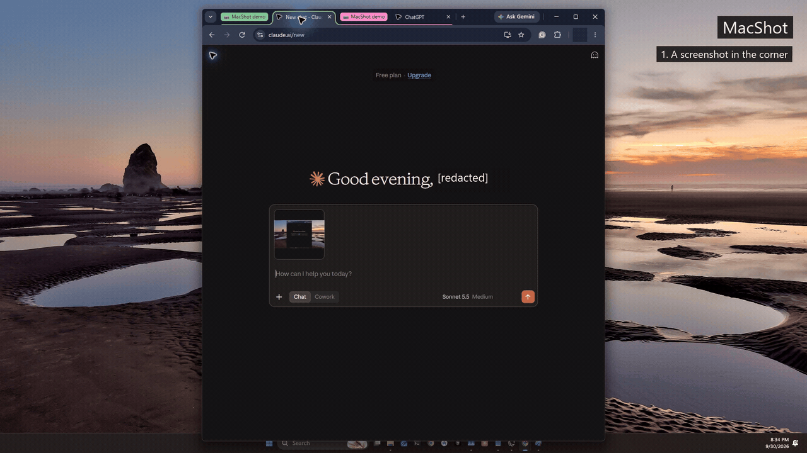
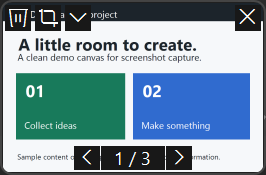
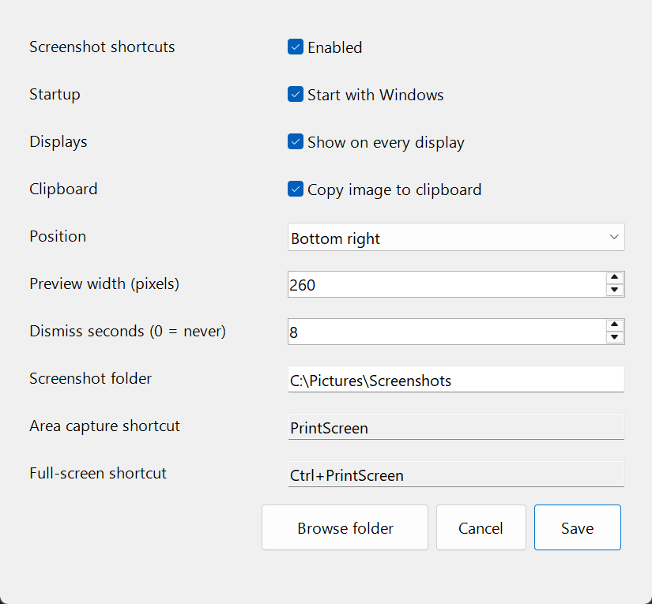
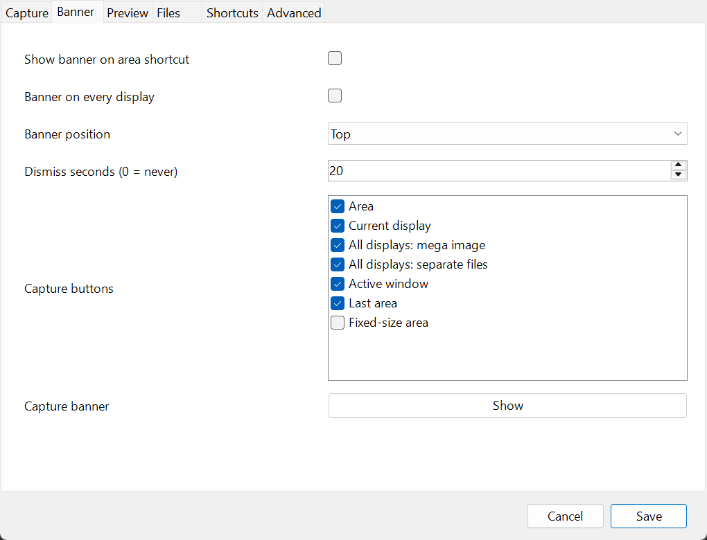
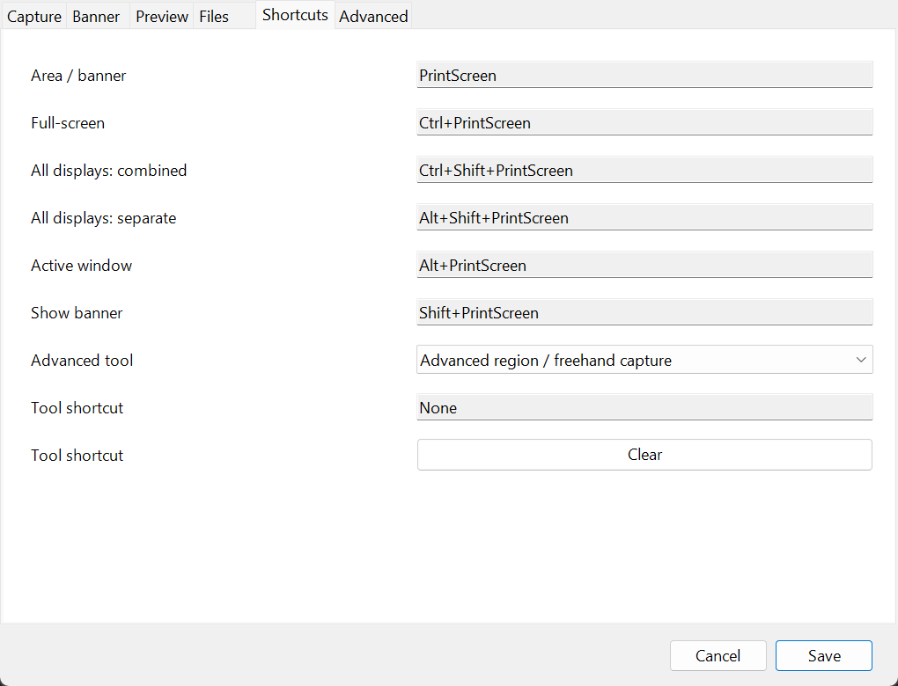
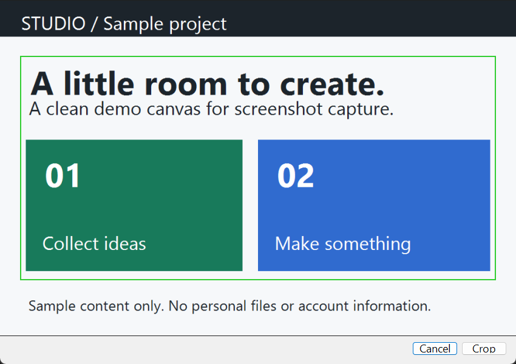

# MacShot Thumbnail

A lightweight Windows screenshot utility with Mac-style draggable previews and an optional capture banner.

Press **Print Screen**, select an area, and a temporary thumbnail appears at the bottom right of every display. Drag it into an app, crop it, move the file to the Recycle Bin, or dismiss it without deleting the file. After dragging, the thumbnail remains available briefly so you can trash the original.

## Capture Modes

| Default shortcut | Action |
| --- | --- |
| Print Screen | Area capture, or capture banner when enabled |
| Ctrl+Print Screen | Current display, configurable to either all-display mode |
| Ctrl+Shift+Print Screen | All displays as one mega screenshot |
| Alt+Shift+Print Screen | Separate screenshots of all displays at once |
| Alt+Print Screen | Active window |
| Shift+Print Screen | Show / dismiss the capture banner |

The mega screenshot follows your Windows monitor arrangement at original resolutions, including negative coordinates. Empty spaces between monitors are black. Separate images come from the same desktop capture, one file per display; use the thumbnail arrows to browse them. Trashing one file keeps the other display files.

The tray menu also offers last-area and fixed-size capture. Native capture samples visible desktop pixels; it does not reconstruct occluded windows. Captures support a delay and optional mouse pointer.

## Settings

Open **MacShot Settings** from Start, double-click its tray icon, or run the executable again. Click **Save** to apply.

- **Capture:** enabled switch, Windows startup, full-screen capture mode, delay, pointer, fixed-size dimensions, sound and quick all-display capture commands.
- **Banner:** enable the Adobe-style capture strip for Print Screen, select its buttons, choose top/bottom, show it on one or all displays, and set its dismissal timer. Escape or the close icon dismisses it. Selecting a capture hides every banner before sampling pixels.
- **Preview:** one/all displays, corner, width, margin, opacity, timeout, hover pause, post-drag timeout, and individual action buttons. Zero timeout keeps previews until dismissed.
- **Files:** destination, PNG/JPEG/BMP/TIFF, JPEG quality, filename prefix, clipboard image/file options and automatic editing.
- **Shortcuts:** six native bindings and optional per-tool bindings. Click a shortcut field and press the desired combination; Clear removes an advanced binding. Print Screen and F1-F24 accept optional Ctrl/Alt/Shift; letters require Ctrl or Alt. Windows-key shortcuts are not supported. Duplicate bindings are rejected.
- **Advanced:** install/enable the optional ShareX toolkit, choose visible tools, video/GIF frame rates, recording pointer, FFmpeg path, and open detailed toolkit preferences.

The preview's trash can recycles the file and closes its mirrors. Crop updates the existing file in its original format. The more button offers copy image/file/all files, folder/history, editing, OCR, effects and pinning. Image click, right-click or close dismisses previews without deleting files. Clipboard image copying uses the first image in a separate-display batch; file copying includes every image.

**Screenshot history** in the tray menu provides search, preview, copying, crop, editing, OCR, pinning and recycling. Files remain in your selected folder; there is no automatic retention/deletion policy.

## Advanced Tools

Install the toolkit from **Settings > Advanced**. MacShot downloads the official portable ShareX 21.0.0 release and verifies its pinned SHA-256. Native capture does not require it.

Advanced workflows include scrolling/freehand/interval capture, MP4/GIF recording, pause/stop/abort, annotations, blur/pixelation, text/arrows/steps/callouts, effects/backgrounds, OCR, QR, persistent pins, color picker, ruler, image combining/splitting/comparison/resizing and video conversion. Individual tools intentionally open an editor or dialog; normal screenshots retain the temporary-thumbnail workflow.

**Open toolkit settings** opens ShareX. Its **Task settings** and individual editors expose detailed region, recording, OCR, effects and editing controls. MacShot-managed defaults take effect on the next toolkit launch. Use **Close toolkit** before changing these defaults; do not close it during a recording you want to keep. It has its own tray menu and is independent of MacShot's startup supervisor. Recording requires FFmpeg; point settings at an existing executable or use ShareX's encoder setup. Background removal needs a separate model download.

New advanced image captures are copied into the native screenshot folder and displayed as thumbnails. Originals, recordings and advanced exports remain in `%LOCALAPPDATA%\MacShotThumbnail\AdvancedCaptures`, accessible through advanced history. MacShot leaves uploads disabled and does not register competing ShareX hotkeys. OCR recognition is local; optional service-link actions are separate. Users can change ShareX preferences, so the profile is not a network sandbox.

See the [feature comparison](docs/FEATURE-COMPARISON.md) for the major open/closed-source tools reviewed, coverage and exclusions. This is not a promise to reproduce every proprietary AI, cloud, collaboration or document-authoring feature. [Integration details and licenses](docs/INTEGRATIONS.md).

## On, Off, and Startup

**Enabled** releases or restores MacShot's global shortcuts without changing startup. Manual capture commands remain available. **Quit** exits MacShot normally; its supervisor does not restart an intentional quit. Launch MacShot Settings to start it again. **Start with Windows** controls automatic sign-in startup.

Settings are stored in `%LOCALAPPDATA%\MacShotThumbnail\settings.json`. Invalid ranges and shortcut collisions recover safely on load. Diagnostic logs in the same folder rotate at 1 MB. Screenshots may sync through OneDrive if your chosen destination is already inside OneDrive.

## Screenshots



[Watch the full-desktop MP4 demo](docs/demos/macshot-claude-drag-v2.mp4): drag the bottom-right screenshot preview into Claude's composer and see a second image attach while the preview stays available. The whole Windows desktop, wallpaper and taskbar remain visible. This is the native thumbnail's real Windows drag-and-drop, not clipboard paste or an inserted animation. Personal identity is redacted and no message was sent. [Attached-image still](docs/demos/macshot-claude-attached.png) / [Recording details](docs/demos/README.md).

[Additional feature walkthrough](docs/demos/macshot-demo.mp4) / [GIF](docs/demos/macshot-demo.gif): capture banner, crop, Recycle Bin, dismiss, and settings using scripted controls and sample content.

The additional walkthrough and settings images use synthetic sample content. The Claude demo uses a reviewed desktop screenshot and hides personal identity and chat history.












[Preview settings](docs/screenshots/settings-preview.png), [file settings](docs/screenshots/settings-files.png), [advanced settings](docs/screenshots/settings-advanced.png), [desktop example](docs/screenshots/desktop-overview.png).

## Download and Install

Download the Windows x64 ZIP from [Releases](https://github.com/gitWRLD999/macshot-thumbnail/releases), extract it, and run `MacShotThumbnail.exe`. The self-contained download includes .NET. Windows 11 x64 is the tested platform; the executable is unsigned.

To install and start at sign-in, run in PowerShell from the extracted directory:

```powershell
.\Install.ps1
```

It installs under `%LOCALAPPDATA%\Programs\MacShotThumbnail` and creates a per-user sign-in task, delayed ten seconds, without administrator access. It runs on battery without a time cutoff. The supervisor restarts unexpected exits after five seconds, with up to three consecutive short-lived failures; Task Scheduler also has a three-retry policy. The installer migrates older registry startup entries. Running the EXE alone does not enable startup. Only one native instance runs; quit the installed instance before trying a portable copy.

`Uninstall.ps1` removes the native app/startup task, preserving screenshots, settings and optional toolkit data.

## Compatibility

The keyboard hook runs on its own message thread and renews every thirty seconds. Only configured combinations are consumed; keystrokes are not logged. Native selection/cropping and settings focus suspend global bindings. Advanced-tool shortcuts remain available during recordings so stop/pause can work; avoid assigning keys needed inside an editor.

If Adobe Express Photos takes Print Screen, disable its Screenshot Shortcut / Print screen key toggle. [Adobe's instructions](https://helpx.adobe.com/au/express-photos/desktop/edit-images/revert-print-screen-settings.html). Other screenshot utilities may also compete.

Drag/drop depends on the destination app and Windows privilege restrictions. Mixed-DPI, HDR, protected content, unusually large desktops and unusual keyboard mappings are not comprehensively tested. Captures over 100 megapixels are rejected. This is an early release tested on one computer with three displays, not affiliated with Apple, Microsoft, Adobe or the compared products.

## Build and Verify

Requires Windows and the .NET 9 SDK:

```powershell
dotnet build src/MacShotThumbnail -c Release
dotnet publish src/MacShotThumbnail -c Release -r win-x64 --self-contained true -p:PublishSingleFile=true -p:IncludeNativeLibrariesForSelfExtract=true -p:DebugType=None -o dist/windows-x64
dotnet run --project src/ThumbnailVerification -c Release
```

The interactive verification checks thumbnail file locks, corners, mirrored recycling, post-drag grace, crop coordinates, output codecs, settings recovery, banner actions, all settings tabs, and real mega/separate display capture. Native captures generated by verification are deleted afterward; synthetic recycle tests remain recoverable in the Recycle Bin. Optional `--recording-test` checks MP4/GIF recording using an installed toolkit and configured FFmpeg.

The area selector, advanced annotation and local OCR were also exercised through desktop control. Full reboot behavior, every advanced setting and broad drag/drop compatibility remain unverified. [Report bugs](https://github.com/gitWRLD999/macshot-thumbnail/issues) with Windows version, scaling and reproduction steps.

## License

[MIT](LICENSE) for MacShot. Bundled .NET runtime notices remain under their own terms. Optional unmodified ShareX is a separate GPL application; it is not included in MacShot's ZIP or relicensed as MIT.
