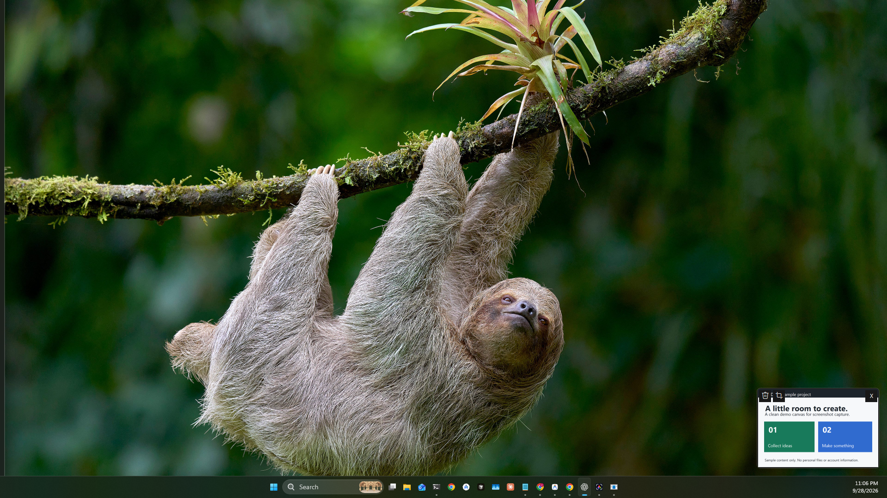
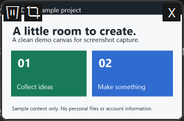

# MacShot Thumbnail

A small Windows screenshot utility inspired by the Mac's floating screenshot thumbnail.

Press **Print Screen**, drag to select an area, and a temporary thumbnail appears in the bottom-right corner of every display. Each preview represents the same saved PNG.

- Drag the thumbnail into an application that accepts image files.
- Click the thumbnail, right-click it, or click X to dismiss it.
- Hover to reveal a trash-can button that moves the saved PNG to the Recycle Bin.
- Leave it alone and it fades after eight seconds. Hovering restarts the countdown.
- Screenshots are saved in your Windows Pictures folder under `Screenshots` and copied to the clipboard when available.
- The tray menu provides settings, an enabled switch, full-screen capture, access to saved screenshots, and Quit.

## On, Off, and Settings

Open **MacShot Settings** from the Windows Start menu, or double-click the MacShot tray icon (it may be behind the tray's upward arrow). Opening the executable again also opens settings for the existing instance.

- **Enabled** controls the Print Screen shortcut. Turn it off to let Windows handle Print Screen normally; turn it back on to restore MacShot. The tray menu has the same switch.
- **Quit** in the tray menu fully exits the app. Launch MacShot Settings to start it again.
- **Start with Windows** controls sign-in startup independently of Enabled.
- Settings include every display versus the pointer's display, four corners, preview width, auto-dismiss duration (zero means never), clipboard copying, and the screenshot folder. Click Save to apply.
- Dismissing a preview keeps the file. Trashing closes all mirrored previews. After dragging, the source preview remains for at least eight seconds so you can trash it. If the receiving app moves or deletes the original file, its preview closes.
- Hover and click the crop icon, select a rectangle, then click Crop. This replaces the saved PNG and refreshes previews and the clipboard; Cancel leaves it unchanged.
- Area capture defaults to Print Screen; full-screen capture (the display under the pointer) defaults to Ctrl+Print Screen. Click either shortcut field and press a new combination, then Save. Supported keys: Print Screen or F1-F24 with optional modifiers, or Ctrl/Alt plus a letter (Shift is optional). Windows-key combinations are not supported. Avoid shortcuts already used by another app.

Settings persist in `%LOCALAPPDATA%\MacShotThumbnail\settings.json`. Recoverable capture errors are reported through a tray notification; diagnostic logs are size-limited in that same folder. Invalid settings fall back to defaults. Screenshots are never uploaded.

This is an **early release**, developed and tested on one Windows 11 computer. It is not affiliated with Apple or Microsoft.

## Screenshots

Actual app controls captured with sample content and a generic folder path. No personal files or account information is included.

### Desktop Overview

The floating thumbnail on a 1920 x 1080 display, above the taskbar. Sample content is used in the preview.



### Floating Thumbnail

Hover controls: trash, crop, and dismiss. The preview remains available briefly after dragging.



### Crop a Screenshot

Select a rectangle, then confirm with Crop. Cancel keeps the original.


### Settings and Shortcuts

Configure preview behavior and separate shortcuts for area and full-screen capture.


## Download and Run

Download the Windows x64 ZIP from [Releases](https://github.com/gitWRLD999/macshot-thumbnail/releases), extract it, and run `MacShotThumbnail.exe`. The download includes the .NET runtime; you do not need to install .NET separately.

Windows 11 x64 is the tested platform. The executable is unsigned. There is no account, updater, telemetry, or screenshot upload feature.

For installation and automatic startup at sign-in, run `Install.ps1` from PowerShell in the extracted folder:

```powershell
.\Install.ps1
```

It installs under `%LOCALAPPDATA%\Programs\MacShotThumbnail` and creates a per-user Task Scheduler task that starts ten seconds after sign-in. It runs in your desktop session without administrator privileges and keeps running on battery. A small supervisor restarts the app five seconds after an unexpected exit, with up to three consecutive short-lived failures. Task Scheduler also has a three-retry failure policy. Use `Uninstall.ps1` to remove the app and task. Uninstalling does not delete your screenshots.

The **Start with Windows** setting controls that task. Choosing Quit exits normally and does not trigger crash recovery. The installer migrates older registry startup entries to the task.

Running the EXE directly is portable and does not enable startup. Only one instance runs at a time; quit an installed copy from its tray menu before trying a portable copy.

## Behavior and Limits

The app listens for your two configured shortcuts through a Windows keyboard hook on a dedicated message thread. Capture and crop operations do not block that thread. The hook renews every thirty seconds to recover from removal or changes in hook order. Other combinations pass through. It does not record or store keystrokes. Disable it or quit from the tray to release the shortcuts. Shortcuts are suspended while settings or a capture editor has focus.

If Adobe Express Photos opens from Print Screen, turn off its **Screenshot Shortcut** toggle in Adobe's settings, or uncheck **Print screen key** in its screenshot toolbar settings. [Adobe's instructions](https://helpx.adobe.com/au/express-photos/desktop/edit-images/revert-print-screen-settings.html) describe both controls. Other screenshot apps can also compete for the key.

Dismissal keeps the saved screenshot. The trash-can button sends it to the Recycle Bin. If your Pictures folder is redirected to OneDrive, Windows/OneDrive may sync the saved files according to your existing settings.

Drag-and-drop depends on the receiving app. Windows may prevent drops between apps running at different privilege levels. Mixed-DPI monitors, HDR, protected content, unusual keyboard mappings, and competing screenshot utilities have not been comprehensively tested. There is no annotation editor.

## Build

Requires Windows and the .NET 9 SDK.

```powershell
dotnet build src/MacShotThumbnail/MacShotThumbnail.csproj -c Release
dotnet publish src/MacShotThumbnail/MacShotThumbnail.csproj -c Release -r win-x64 --self-contained true -p:PublishSingleFile=true -p:IncludeNativeLibrariesForSelfExtract=true -p:DebugType=None -o dist/windows-x64
```

## Verification

```powershell
dotnet run --project src/ThumbnailVerification/ThumbnailVerification.csproj -c Release
```

Run in an interactive Windows desktop session. The check creates a synthetic image, opens previews on all connected displays, verifies exclusive PNG access and corner placement (including negative coordinates), checks the trash icon, and verifies that recycling closes the mirrored previews. It leaves its synthetic test image recoverable in the Recycle Bin. This passed on three connected displays.

The Print Screen area selector was also exercised through desktop control. Physical drag-and-drop into other apps and behavior after reboot remain unverified. Bug reports with Windows version, display scaling, and reproduction steps are welcome in [Issues](https://github.com/gitWRLD999/macshot-thumbnail/issues).

## License

[MIT](LICENSE). The bundled .NET runtime remains under its own third-party license notices.
